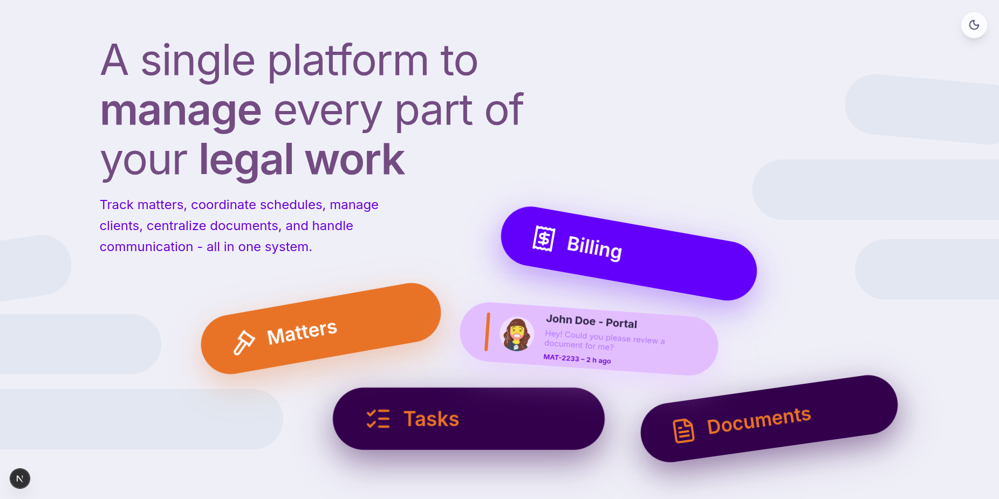
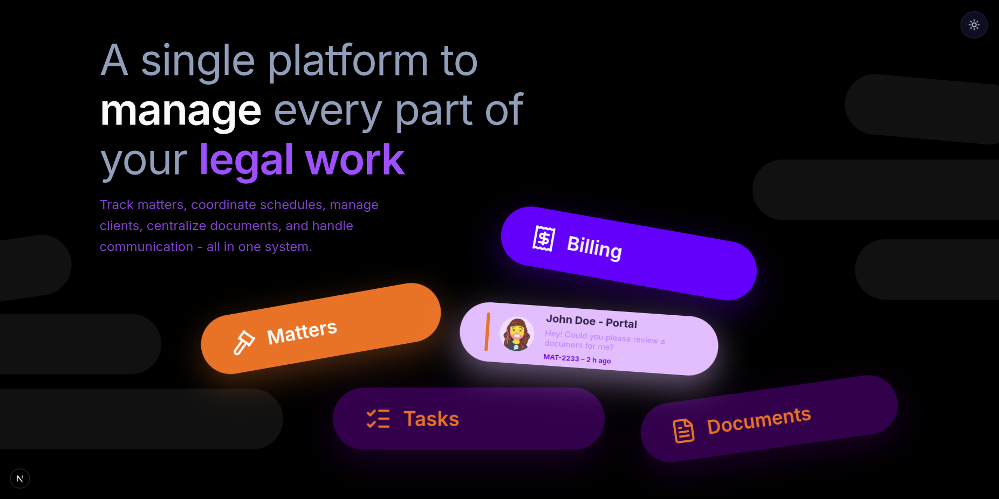

# Legal Work Management Platform

A modern, animated hero landing page for a legal work management platform built with Next.js 16, React 19, Framer Motion, and Tailwind CSS. Features smooth animations, floating cards, and a responsive design with both light and dark theme support.

## Screenshots

### Light Theme


### Dark Theme


## Features

- **Responsive Design**: Fully responsive layout that scales beautifully across all devices (desktop, tablet, and mobile)
- **Theme Toggle**: Seamless dark/light mode switching with smooth transitions
- **Animated UI**: Smooth floating card animations using Framer Motion
- **Modern Stack**: Built with the latest Next.js 16 and React 19
- **TypeScript**: Fully typed for better developer experience and code quality
- **Tailwind CSS**: Utility-first CSS framework with custom Tailwind v4 configuration
- **Interactive Cards**: Hover effects and floating animations on feature cards
- **Optimized Performance**: Server-side rendering and optimized build outputs

## Tech Stack

- **Framework**: [Next.js 16](https://nextjs.org/) with App Router
- **UI Library**: [React 19](https://react.dev/)
- **Animation**: [Framer Motion 12](https://www.framer.com/motion/)
- **Styling**: [Tailwind CSS 4](https://tailwindcss.com/)
- **Theme Management**: [next-themes](https://github.com/pacocoursey/next-themes)
- **Icons**: [Lucide React](https://lucide.dev/)
- **Language**: [TypeScript 5](https://www.typescriptlang.org/)

## Key Components

- **Hero Section**: Main landing section with responsive scaling and floating card layout
- **FloatingCard**: Reusable animated card component with customizable colors, rotations, and content
- **ThemeToggle**: Dark/light mode toggle with animated sun/moon icon
- **ThemeProvider**: Context provider for theme management across the app

## Getting Started

First, install the dependencies:

```bash
npm install
```

Then, run the development server:

```bash
npm run dev
```

Open [http://localhost:3000](http://localhost:3000) with your browser to see the result.

## Project Structure

```
Round-1/
├── src/
│   ├── app/
│   │   ├── globals.css       # Global styles
│   │   ├── layout.tsx        # Root layout with theme provider
│   │   └── page.tsx          # Home page
│   ├── components/
│   │   ├── FloatingCard.tsx  # Animated floating card component
│   │   ├── Hero.tsx          # Hero section with feature cards
│   │   ├── ThemeProvider.tsx # Theme context provider
│   │   └── ThemeToggle.tsx   # Theme toggle button
│   └── lib/
│       └── utils.ts          # Utility functions (cn, etc.)
├── public/                   # Static assets
├── light.png                 # Light theme screenshot
├── dark.png                  # Dark theme screenshot
└── package.json              # Project dependencies
```

## Available Scripts

- `npm run dev` - Start development server
- `npm run build` - Build for production
- `npm start` - Start production server
- `npm run lint` - Run ESLint

## Features Showcase

The landing page showcases a legal work management platform with the following feature cards:

- **Billing** - Financial management and invoicing
- **Matters** - Legal case management
- **Client Portal** - Client communication and document sharing
- **Tasks** - Task management and tracking
- **Documents** - Document management and storage

Each feature card has unique styling, colors, and animations that create an engaging user experience.